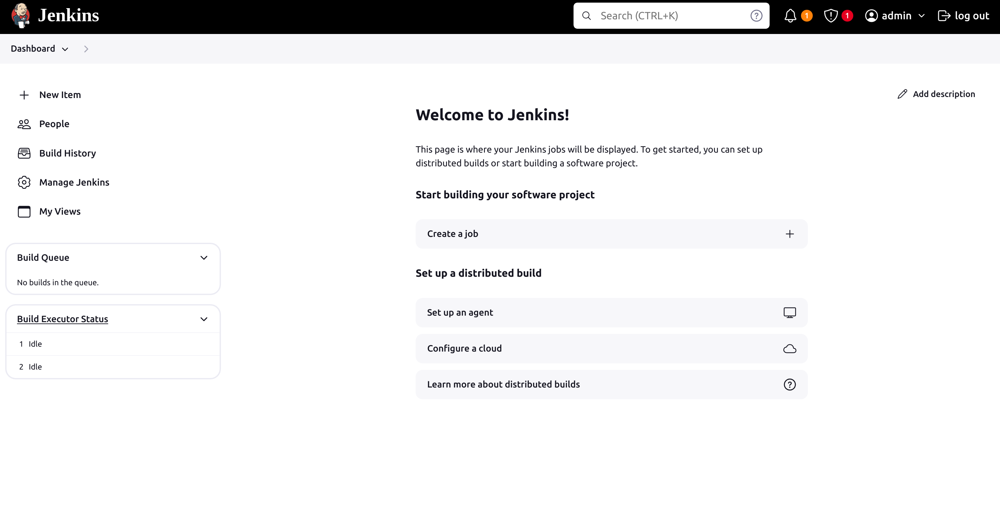
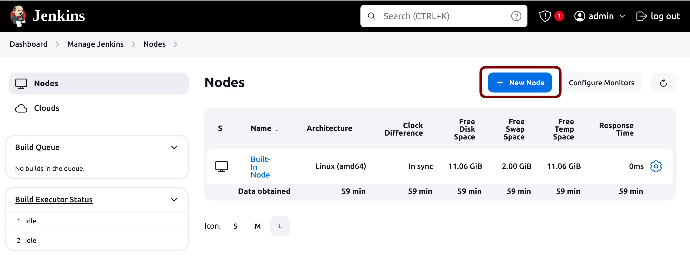
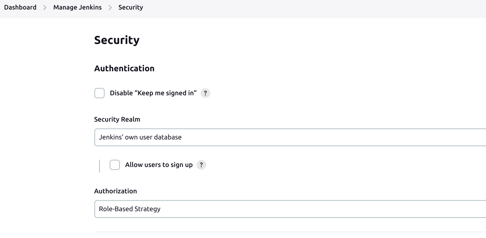
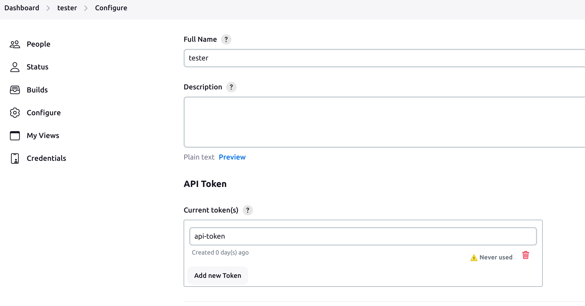

# Jenkins Job Manager

## This presentation will show how to create basic Jenkins setup with use of *freestyle* and *pipeline* jobs. Here you will also find a basic introduction to Docker. It will also demonstrate how to use exising Python tools and modules to make Jenkins management simpler. You will learn how to create, delete and reconfigure jobs. It will also highlight another Jenkins related features. I will demonstrate low level features of Python which can be useful in many different applications. This demo assumes you have docker installed and working: [docker installation](https://docs.docker.com/get-docker/).<br>
## We will create a Jenkins stages which will test and release THIS PROJECT contents. There will be steps to perform:
* ## linting and static analysis (*pylint*, *flake8*, *mypy*)
* ## unit-tests (*pytest*, *coverage*)
* ## relase (*setuptools*, *wheel*)
## Each stage should report and archive its results.<br><br>

## Here are topic covered in this demo:
## [Jenkins setup](##Jenkins-setup)
* [Jenkins documentation](#Jenkins-documentation)
  * [Jenkins controllers and agents](#More-detailed-information-on-Jenkins-controllers)
  * [Jenkins installation](#instructions-how-to-install-jenkins-can-be-found-here-httpswwwjenkinsiodocbookinstalling)

* [Running jenkins in docker](#this-tutorial-will-be-based-on-jenkins-on-decker-and-it-will-slightly-differ-from-the-examples-mentioned-in-referred-links-the-point-of-this-tutorial-is-to-show-how-to-create-a-basic-setup-and-manage-it-with-python)
  * [Agent docker image](#agent-docker-image)
  * [Jenkins cotroller docker-compose](#jenkins-controller-docker-compose)
  * [Adding Jenkins Agent](#adding-jenkins-agent)
* [First Jenkins job](#adding-a-job)


## [Python and Jenkins](#python-and-jenkins)
* [Jenkins API/CLI](#jenkins-apicli)
* [*python-jenkins* module](#python-jenkins-module)
* [xml parsing and unparsing with *xmltodict* module](#xml-parsingunparsing-with-xmltodict-module)
* [Low-level Python to make things easier](#how-to-make-xml-parsing-simpler-with-python-low-level-feateures)
* [Putting it all together](#putting-it-all-together-with-cli-based-script-argparse-with-subparsers)


## Jenkins setup
Refer to below documentation to get more details on Jenkins but I beleive this article should contain everything to make this demo run just by follwing the steps and use resources added here.
* #### Jenkins documentation: https://www.jenkins.io/doc/ <br>
* #### More detailed information on Jenkins controllers and agents: https://www.jenkins.io/doc/book/managing/nodes/ 

* #### Instructions how to install Jenkins can be found here: https://www.jenkins.io/doc/book/installing/

* #### This tutorial will be based on Jenkins on Decker and it will slightly differ from the examples mentioned in referred links. The point of this tutorial is to show how to create a basic setup and manage it with Python.
 ## *Dockerfile* and *docker-compose* file overwiew
 If you have no docker installed and running refer to [docker installation](https://docs.docker.com/get-docker/).<br>
 **This project was prepared on Ubuntu 22.04 with docker running as a service*<br>
 <br>
 Jenkins can be deployed in few different ways as described in [Jenkins setup](##Jenkins-setup) section but here I am going to use Docker becuase of the following reasons:<br>
 Docker can make your life much easier if you have to create a system which depends and few services. It also lets you keep your host system clean and run other servies in isolation. Docker approach will help you to maintain and manage "system" you are going to deploy. It is fairly easy to revert changes, do a step back or modify anything "from the past". This example also shows how easly you can communicate a system where there is a controller and agent(s), something similar to server-client relation. Docker compose encpsulates this system in single network. Modules like *docker swarm* can monitor your setup and keep it alive but this is not part of this presentation.<br>
 We are going to deploy CI/CD system for this project which will perform thress stages:
 * linting and static analysis
 * unit testing
 * packaging and relase

 All the work will be done of one of the agents, here there will be only one. For this task the agent should contain all the required tools and applications like:
 * Python
 * static analysis tools
 * packaging tools

## Agent docker image
Since this example is mostly based on Python we need to prepare an enviroment to performa all those actions. Luckly there is ready to use [jenkins/inbound-agent](https://hub.docker.com/layers/jenkins/inbound-agent/latest/images/sha256-8742a4fce1bb6664f5e4f6b133a2673eeeb0cf35e6a00fc8ffec8531bf9c18d3?context=explore) docker file. If you open the link [jenkins/inbound-agent](https://hub.docker.com/layers/jenkins/inbound-agent/latest/images/sha256-8742a4fce1bb6664f5e4f6b133a2673eeeb0cf35e6a00fc8ffec8531bf9c18d3?context=explore) you can get more details which steps there are performed to run the agent. We will get back to it later when will try to connect *agent* to *Jenkins controller*. For higlight I reccomend to review *IMAGE LAYERS* steps and corresponding commands:

<p align="center">

</p>


The most important will be the last one.<br>
Using that image as a base for this project we need to add few more things which are shown in the [dockerfile-python-agent](./docker/dockerfile-python-agent)
```docker
FROM jenkins/inbound-agent:latest

USER root

# Install Python 3 and tools
RUN apt-get update
RUN apt-get install -y python3.11 python3.11-dev python3.11-distutils python3-pip
RUN apt install -y python3-pytest python3-flake8 pylint python3-mypy

CMD /usr/bin/bash

USER jenkins
```
As we can see it is going to 'extend' exisiting image with the tools required for the project.
All the `RUN` entries could be joined with `&&` but in this case I prefer to have each `RUN` separate. In case there is a need to remove one step or add something new build of such image will be much faster but on the other hand it will cause image to grow in size. Each `RUN` instruction in a Dockerfile adds a new layer to the image. Docker images are made up of multiple layers, and each layer represents a set of differences from the previous layer. More layers can lead to a larger overall image size, as each RUN command adds some overhead. In this case I care more about speed and time. But note this matters only if you are building the image for the first time or you want to modify it. By the way all instructions in our docker are just extending *IMAGE LAYERS* shown on the picture of *jenkins/inbound-agent* above. It is possible to see all layers and layer sizes with:
```bash
$ docker history -H <image-name>
```

You can build customized image now with:
```bash
$ docker build -t python-agent -f ./dockerfile-python-agent .
```
but lets skip it as this will be part of `docker-compose` file which should simplify maintenance of the system.


## Jenkins controller docker-compose
If there is more than one docker container to be deployed and all container somehow depends on each other it is worth to configure all details in single *docker-compose* file. Below there is *docker-compose* file which deploys only *Jenkins Controller* but in next step I am going to add one *Jenkins Agent* there. 
```yaml
version: '3.8'
services:
  jenkins-master:
    image: jenkins/jenkins:lts
    container_name: jenkins-master
    ports:
      - "8080:8080"
      - "50000:50000"
    volumes:
      - jenkins_home:/var/jenkins_home
    environment:
      - JENKINS_OPTS=--prefix=/jenkins
    restart: unless-stopped

volumes:
  jenkins_home:
```
Here is short explanation of this *docker-compose* file:

* Jenkins Master: The service is defined under the name jenkins-master.
* Image: The container uses the jenkins/jenkins:lts image, which is the long-term support version of Jenkins, ensuring stability and security.
* Container Name: The container is named jenkins-master.
* Ports: Two ports are exposed:
  * Port 8080 is mapped from the host to the container, which is the standard port for accessing the Jenkins web interface.
  * Port 50000 is also exposed, which is used for Jenkins agents to connect to the master.
* Volumes: A volume named jenkins_home is mounted to /var/jenkins_home inside the container. This volume stores Jenkins data, including configuration, jobs, and plugin information, allowing data persistence across container restarts.
* Environment Variables: An environment variable JENKINS_OPTS is set with the value --prefix=/jenkins, which configures Jenkins to be served under a URL prefix (i.e., http://<host>:8080/jenkins).
* Restart Policy: The service is configured to restart automatically unless it is explicitly stopped. This ensures that the Jenkins server remains running unless manually intervened.
* Volumes Configuration:
  * jenkins_home: This named volume is declared at the top level, which Docker Compose uses to manage Docker volumes independently of the lifecycle of containers, enhancing data durability and ease of data backup and migration.
<br>

Lets run *Jenkins* now.
* *navigate to a location where docker-compose.yaml is. For the first time I recommend to run without detaching (without -d option)*
```
$ dokcer compose up
```

## Running and initial configuration of jenkins with docker compose.
* This project includes [docker-compose.yaml](./docker/docker-compose.yaml) file to start with
* To run Jenkins do:
```bash
$ cd docker
$ docker compose up -d
```

You should be able to see such output with password required to unlock jenkins:

```bash
$ docker logs jenkins-controller

2024-04-10 20:33:01.117+0000 [id=80]	INFO	jenkins.install.SetupWizard#init: 

*************************************************************
*************************************************************
*************************************************************

Jenkins initial setup is required. An admin user has been created and a password generated.
Please use the following password to proceed to installation:

XXXXXXXXXXXXXXXXXXXXXXXXXXXXXXXXXXXXXXXX    <--- PASSWORD

This may also be found at: /var/jenkins_home/secrets/initialAdminPassword

*************************************************************
*************************************************************
*************************************************************

2024-04-10 20:33:23.841+0000 [id=80]	INFO	jenkins.InitReactorRunner$1#onAttained: Completed initialization

```

According to *docker-compose* configuration web UI interface should be accessible under http://localhost:8080/jenkins:

<p align="center">

</p>

* Provide password displayed after running `docker compose up` command.
* There will be few more forms to fill:
  * to create admin account
  * dialog to install additional plugins, you can select *Install suggested plugins* but in most cases it fails to install all plugins. For this demo *Pipeline* plugin must be installed but can be installed later

* After completing all steps above there should be an initial *Dashoboard* of Jenkins:

<p align="center" id=jenkins-initial-view>

</p>

## Adding Jenkins Agent

Jenkins Agents are responsible for executing build jobs and offloading work from the master. You can define multiple Agents which can perform different tasks but for this example only one will be sufficient. Requirements and configuration of Jenkins Agent Dockerfile for this project was described above: [Agent configuration](#agent-docker-image).<br>
Adding agent can be done with API or *python-jenkins* module but it makes more sense to do with with web-ui as we need to obtain so called *secret* for agent.<br>
* To add new Agent (node) got to http://localhost:8080/jenkins/manage/computer/ or from *Dashboard* select *Manage Jenkins* and then *Nodes*. Click *"+ New Node"*
<p align="center">

</p>
<p align="center">

</p>

* Fill all necessary data, minimum number of executors for this project should be 2
<p align="center">

</p>

* New agent should be present on Jenkins *Dashboard*, now we need to get *secret* token, if you provided *python-agent1* open http://localhost:8080/jenkins/computer/python-agent1/ or open your new agent from *Dashboard* view. Copy the secret key visible:
<p align="center">

</p>

* Final step is to update [docker-compose.yaml](./docker/docker-compose.yaml) file, replace *XXXXX...* with *secret* token
```yaml
version: '3.8'
services:
  jenkins-master:
    image: jenkins/jenkins:lts
    container_name: jenkins-master
    ports:
      - "8080:8080"
      - "50000:50000"
    volumes:
      - jenkins_home:/var/jenkins_home
    environment:
      - JENKINS_OPTS=--prefix=/jenkins
    restart: unless-stopped

  jenkins-agent:
    image: jenkins/inbound-agent:latest
    container_name: jenkins-agent1
    depends_on:
      - jenkins-master
    volumes:
      - /var/run/docker.sock:/var/run/docker.sock
      - jenkins_agent_home:/home/jenkins
    command: -url http://jenkins-master:8080/jenkins XXXXXXXXXXXXXXXXXXXXXXXXXXXXXXXXXXXXXXXXXXXXXXXXXXXXXXXXX python-agent1
    tty: true
    stdin_open: true
    restart: unless-stopped

volumes:
  jenkins_home:
  jenkins_agent_home:
```

* and then from docker directory run docker compose again (stop previous container if this is still running with `docker compose down`)
```bash
$ docker compose up 
```

There will be prints labeled with container names defined in compose file: *jenkins-master* and *jenkins-agent*. If all was configured correctly you should see agent1 is Connected:
```
jenkins-master  | 2024-04-13 13:43:55.641+0000 [id=133]	INFO	h.TcpSlaveAgentListener$ConnectionHandler#run: Accepted JNLP4-connect connection #2 from /172.27.0.3:43808
jenkins-agent1  | Apr 13, 2024 1:43:55 PM hudson.remoting.Launcher$CuiListener status
jenkins-agent1  | INFO: Remote identity confirmed: 3e:b3:b5:bc:81:75:7e:97:a7:3b:9c:67:d9:91:27:47
jenkins-agent1  | Apr 13, 2024 1:43:55 PM hudson.remoting.Launcher$CuiListener status
jenkins-agent1  | INFO: Connected
```

## Adding a Job
To have better understanding how Jenkins runs jobs lets add some dummy Job. Later we will create a bunch of Python tools to automate such tasks.
* select *'+ New Item'* from *Jenkins Dashboard* or open http://localhost:8080/jenkins/view/all/newJob
* provide a name like "Dummy Job" and choose *Freestyle project* and click `OK`
* on the next form you will find plenty of fields to fill but at the moment most important is option *Restrict where this project can be run*. Note that you can either provide a full *Node*(Agent) name or Agent's label. If there will be different types of jobs which requires different environment it is a good idea to use labels for that. I would suggest set *python* label for *python-agent1* and use that label here as we want to run Python tasks.
* lets choose *Add build step* -> *Execute shell* as this is deployed on Linux
  * we can add something like:
```
whoami 
python3 -V
```
  * job output should reflect Python version defined in agent's dockerfile and user should be *Jenkins*
  * save the settings and run *Build Now*
  * there should appear new build in *Build History* in *Dummy Job* view http://localhost:8080/jenkins/job/Dummy%20Job/
  * console output should look like (http://localhost:8080/jenkins/job/Dummy%20Job/2/console):
  ```
  Started by user admin
Running as SYSTEM
Building remotely on python-agent1 (python) in workspace /home/jenkins/workspace/Dummy Job
[Dummy Job] $ /bin/sh -xe /tmp/jenkins10178526424899115512.sh
+ whoami
jenkins
+ python3 -V
Python 3.11.2
Finished: SUCCESS
```

## So that's it for the first part. In the second part, I am going to show how to use Python to manage Jenkins jobs.


## Jenkins API

Jenkins offers a rich set of functionalities via its REST API, allowing you to automate and interact with Jenkins programmatically. Here's a list of common actions you can perform over the Jenkins API:

* Build Management
    * Trigger a build for a specific job.
    * Retrieve the status and details of a build.
    * Cancel or stop a running build.
* Job Management
    * List all jobs in Jenkins.
    * Create a new job.
    * Delete an existing job.
    * Update job configuration.
    * Retrieve job configuration.
    * Enable/disable a job.
* Build Queue Management
    * List all items in the build queue.
    * Cancel or remove items from the build queue.
* Node Management
    * List all nodes (Jenkins agents).
    * Get details about a specific node.
    * Enable/disable a node.
    * Delete a node.
* User and Role Management
    * List all users.
    * Get user details.
    * Create/update/delete user roles and permissions.
* Plugin Management
    * List all installed plugins.
    * Install new plugins.
    * Uninstall plugins.
    * Get plugin details.
* Credential Management
    * List all stored credentials.
    * Add/update/delete credentials.
* Build Artifact Management
    * Download build artifacts.
    * List build artifacts.
* System Information
    * Get Jenkins system information.
    * Retrieve Jenkins version and system health status.
* and more


In order to use API we will need get Jenkins API token (https://www.jenkins.io/doc/book/managing/cli/#authentication) but first we need to create a user:
* Install `Role-based Authorization Strategy` plugin http://localhost:8080/jenkins/manage/pluginManager/available
* In *Manage Jenkins -> Security* set:
<p align="center">

</p>

* create new user: http://localhost:8080/jenkins/manage/securityRealm/addUser
* logout from *Administrator* account and log in as newly created user, in my case new user is *tester*
* Create API token for *tester* user: http://localhost:8080/jenkins/me/configure
<p align="center">

</p>

* store this token, the best is to use [*.netrc* ](https://www.gnu.org/software/inetutils/manual/html_node/The-_002enetrc-file.html) file 
  * just add such line in your `$HOME\.netrc` on you machine (replace `XXX` with generated token):
  ```bash
  echo "machine localhost:8080 login tester password XXXXXXXXXXXXXXXXXXXXXXXXXXXXXXX" >> ~/.netrc
  ```

## Python support for Jenkins 

In this tutorial we will focus on jobs creation, configuration and reconfiguration. This can turn out to be very helpful in case there is larger number of jobs to be maintained. Very often it happens jobs share some common logic or can depend on each other. Keeping that dependency is much easier if we apply a programmatic approach like Python.<br>
I am going to use [python-jenkins](https://python-jenkins.readthedocs.io/) module for that. It offers most of the features listed above. 
```bash
pip install python-jenkins
```

Having all setup lets create first Job:<br>
```python
import jenkins
from pprint import pprint
import lib.jenkins_api as jenkins_api
server = jenkins_api.get_jenkins_server()
server.create_job('dummy job', jenkins.EMPTY_CONFIG_XML)
pprint(server.get_all_jobs())
```

this should print:
```
[{'_class': 'hudson.model.FreeStyleProject',
  'color': 'notbuilt',
  'fullname': 'dummy job',
  'name': 'dummy job',
  'url': 'http://localhost:8080/jenkins/job/dummy%20job/'}]
```
and this job should also be visible on our Jenkins dashboard. As we can see *python-jenkins* module uses xml file `jenkins.EMPTY_CONFIG_XML` as basis to configure project. Any project created on Jenkins has its own *config.xml* file. Once we created *dummy job* we can check this at this URL:<br>http://localhost:8080/jenkins/job/dummy%20job/config.xml<br>
To discover what kind of xml pieces we need to build a job according to our requirements we can create a draft job with web-ui interface and check generated *config.xml* to see what is needed. 

## XML parsing/unparsing with *xmltodict* module
As shown earlier, we're using XML to manage our Jenkins setup. XML (eXtensible Markup Language) is a standard markup language for encoding documents in a structured, human-readable, and machine-readable way. It was designed to store and transport data, providing a flexible framework for representing data structures. While Python has an xml module for parsing XML files, a more user-friendly alternative lets you treat XML as a dictionary, simplifying data handling:
```cli
pip install xmltodict
```

With this module, we can make Jenkins integration more Pythonic. I will demonstrate how to navigate an XML structure as if you're accessing object attributes, just like in most object-oriented programming languages.<br>
In [xml_handler.py](./lib/xml_handler.py) file are two classes which allows that kind of mechanism
* XmlHandler to parse and unparse XML document
```python
class XmlHandler:
    """
    Handle XML document like an OOP object
    """

    def __init__(self, xml_data: str):
      self._data = xmltodict.parse(xml_data) # here data is a dictionary

      # XML can have only one root
      root = list(self._data.keys())[0]
      self._root = XmlElement(self._data[root], parent=self._data)
    
    @property
    def root(self) -> XmlElement:
        """

        @return: XmlElement of root
        """
        return self._root

    def unparse(self) -> str:
        """
        Make XML document out of dict object
        @return: xml as string
        """
        return xmltodict.unparse(self._data, pretty=True)
```

* XmlElement to handle each xml element as an objects attribute

```python
    class XmlElement(dict):
    """
    Defines mechanism to access and modify dict keys as an object attribute
    """
    def __init__(self, value, parent=None):
        """

        @param value: input value
        @param parent: parent to keep track of attribute calls
        """
        self._dict_parent = parent

        # Element can be a dictionary or a plain value like string or int, super-class constructor can run only for dict objects
        if issubclass(type(value), dict):
            dict.__init__(self, value)

    def __getitem__(self, item):
        data = dict.__getitem__(self, item)
        if isinstance(data, dict):
            # Return new XmlElement if an element is another dictionary
            return XmlElement(data, parent=data)
        else:
            # Return plain data
            return data

    def __getattr__(self, item):
        """
        Allows to access dictionary elements by key just like an attribute
        """
        return self.__getitem__(item)

    def __setattr__(self, key: str, value):
        """
        Allows to assign new value for dictionary key with setattr method
        """
        if key.startswith("_"):
            object.__setattr__(self, key, value)
        else:
            self[key] = value

    def __setitem__(self, key, value):
        """
        Sets value into parent's key Keeping the context of parent is substantial to access chained attributes
        @param key: key
        @param value: value to set
        @return:
        """
        self._dict_parent[key] = value

```


#### How to make XML parsing simpler with Python low level feateures
#### Putting it all together with CLI based script (*argparse* with subparsers)

* https://www.jenkins.io/doc/book/managing/cli/#authentication
* http://localhost:8080/jenkins/me/configure
<!-- Let's add the Agent to Jenkins controller:
* open *Manage Jenkins* on Jenkins home page ([picture above](#jenkins-initial-view))
* select *Nodes (Add, remove, control and monitor)* -->


