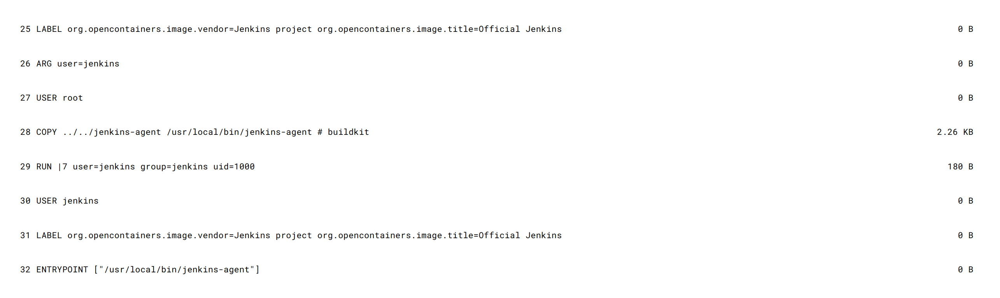
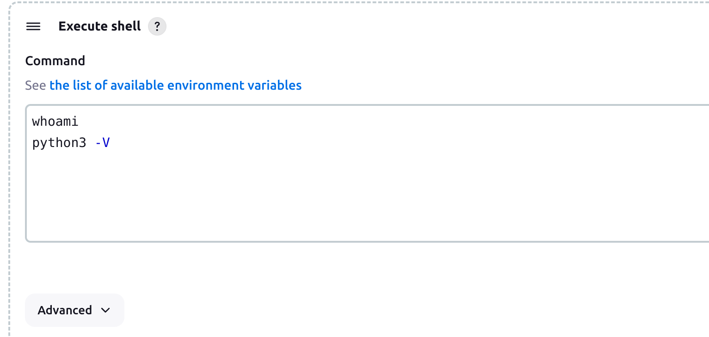
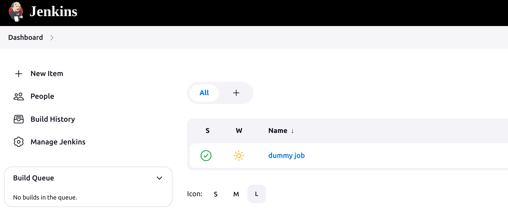
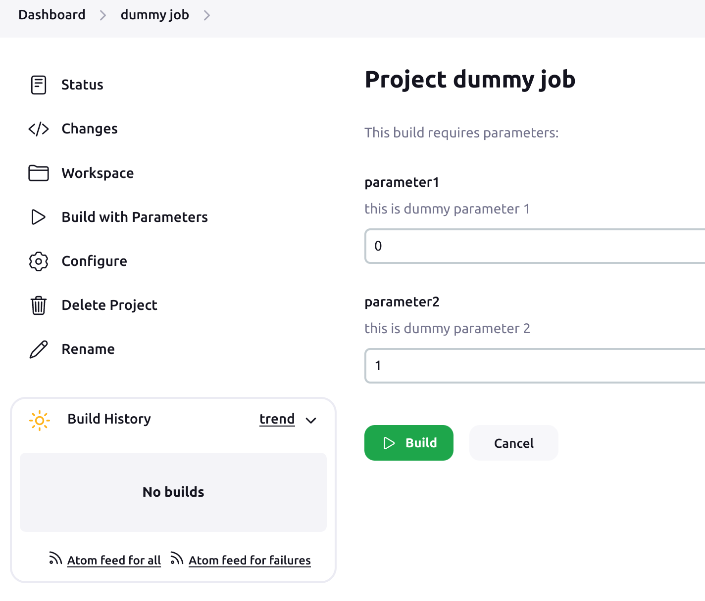
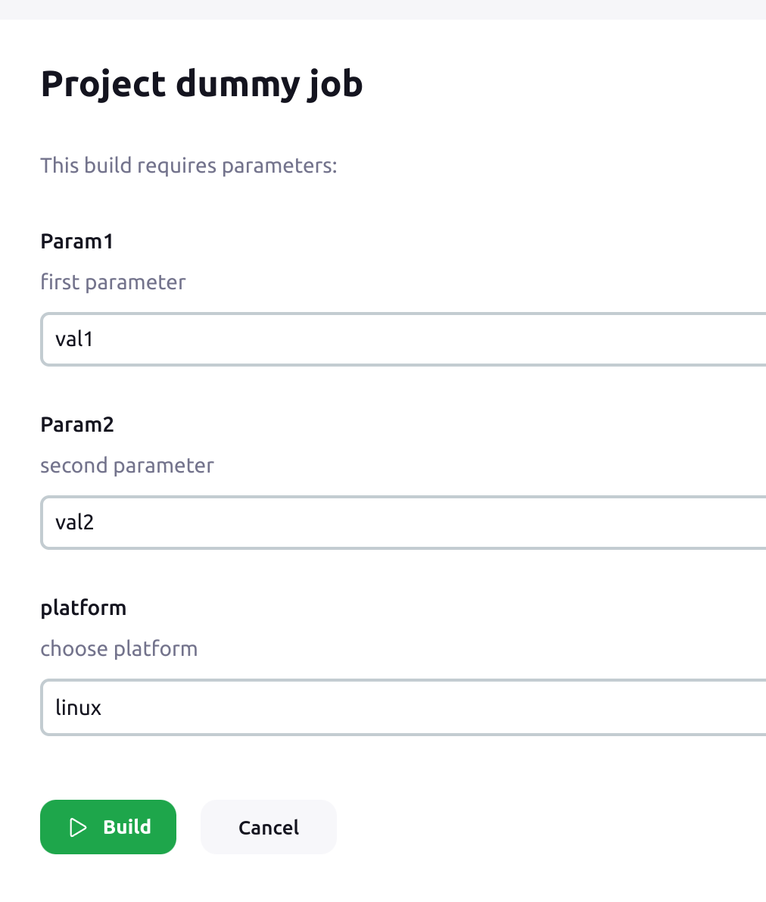
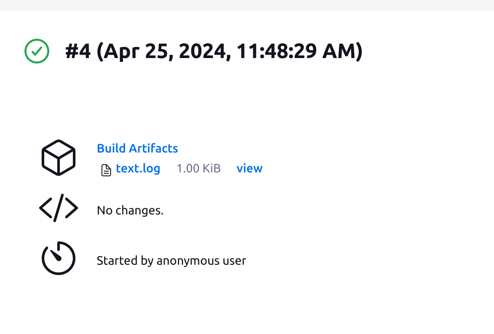

# Efficient Jenkins Management Using Python and Docker

## Overview

This presentation will cover creating a basic Jenkins setup using freestyle and pipeline jobs. It includes a basic introduction to Docker and demonstrates how to simplify Jenkins management with existing Python tools and modules. You will learn how to create, delete, and reconfigure jobs, as well as explore other Jenkins-related features. Additionally, I will showcase low-level Python features that are useful in various applications. Please ensure Docker is installed and working before starting this demo. This presentation assumes the reader has at least a basic understanding of Jenkins and Docker. Please ensure Docker is installed and working before starting this demo.<br> 
Refer to this document to get more details on Docker installation: [docker installation](https://docs.docker.com/get-docker/).<br>

## Topics Covered:

### Jenkins Setup:
- [Jenkins Documentation](#Jenkins-documentation)
- Running Jenkins in Docker
  - [Agent Docker Image](#agent-docker-image)
  - [Jenkins Controller Docker-Compose](#jenkins-controller-docker-compose)
  - [Adding a Jenkins Agent](#adding-jenkins-agent)
- [First Jenkins Job](#adding-a-job)

### Python and Jenkins:
- [Jenkins API/CLI](#jenkins-apicli)
- [*python-jenkins* Module](#python-jenkins-module)
- [XML Parsing and Unparsing with *xmltodict* Module](#xml-parsingunparsing-with-xmltodict-module)
- [Low-Level Python Enhancements](#how-to-make-xml-parsing-simpler-with-python-low-level-feateures)
- [Bringing It All Together](#putting-it-all-together-with-cli-based-script-argparse-with-subparsers)

### [Summary](#summary-and-conclusion)


## Jenkins setup
Refer to below documentation to get more details on Jenkins but this article should contain everything to run this demo by following the steps and by using resources added in this article.
- [Jenkins Documentation](https://www.jenkins.io/doc/)
- [Detailed Information on Jenkins Controllers and Agents](https://www.jenkins.io/doc/book/managing/nodes/)
- [Jenkins Installation Instructions](https://www.jenkins.io/doc/book/installing/)

This tutorial will be based on Jenkins on Docker and it will slightly differ from the examples mentioned in referred links. The point of this tutorial is to show how to create a basic setup and manage it with Python.

 ## Dockerfile and Docker-Compose Overview

 Ensure Docker is installed and running ([Docker installation](https://docs.docker.com/get-docker/)). This project was prepared on Ubuntu 22.04, with Docker running as a service.<br>


 Jenkins can be deployed in few different ways as described in [Jenkins setup](##Jenkins-setup) section but here I am going to use Docker because of the following reasons:
 - Docker can make your life much easier if you have to create a system which depends and few services
 - It also lets you keep your host system clean and run other services in isolation 
 - Docker approach will help you to maintain and manage "system" you are going to deploy
 - It is fairly easy to revert changes, perform a step back to modify anything "from the past"
 <br>
 This example also shows how easily you can communicate a system where there is a controller and agent(s), something similar to server-client relation. Docker compose encapsulates this system in single network. Modules like *docker swarm* can monitor your setup and keep it alive but *docker swarm* is not part of this presentation.<br>
 
## Agent docker image
Jenkins controller requires a workers (agents) to run the jobs. 
Fortunately, there is a ready-to-use Jenkins Agent image: [jenkins/inbound-agent](https://hub.docker.com/layers/jenkins/inbound-agent/latest/images/sha256-8742a4fce1bb6664f5e4f6b133a2673eeeb0cf35e6a00fc8ffec8531bf9c18d3?context=explore) which can be used to connect it to our Controller. By opening the link, you can get more details on the steps required to run the agent. To view the image layers select architecture first like *linux/amd64*. We will return to this later when we try to connect the agent to the Jenkins controller. For now, I recommend reviewing the *IMAGE LAYERS* steps and corresponding commands:

<p align="center">

</p>

<p align="center">

</p>

Above layers view shows the steps required to build the image and it also tells how big each layer is. That allows to calculate total size of the image.


For this tutorial most important will be the last step.<br>
```
32 ENTRYPOINT ["/usr/local/bin/jenkins-agent"]         0 B
```

In a Dockerfile, the ENTRYPOINT instruction is used to define the command that will run as the container's main process (PID 1). This command is executed when the container starts. Unlike the CMD instruction, which can be overridden by command-line arguments provided at container runtime, the *ENTRYPOINT* instruction is designed to be the fixed executable of the container. If the *ENTRYPOINT* application requires arguments those arguments must be provided from *docker run* command or must be defined in docker compose file as *command* entry just like in [docker-compose](#docker-compose.yaml).

Let's assume our Jenkins Agent will run a bunch of tests on a Python project and for that we need:
- python3
- pytest
- mypy
- pylint

We will extend *jenkins/inbound-agent* Docker file so it fulfills our requirements: [https://github.com/codilime/Jenkins-Job-Manager/blob/main/docker/dockerfile-python-agent](https://github.com/codilime/Jenkins-Job-Manager/blob/main/docker/dockerfile-python-agent)
```docker
FROM jenkins/inbound-agent:latest

USER root

# Install Python 3 and required tools
RUN apt-get update
RUN apt-get install -y python3.11 python3.11-dev python3.11-distutils python3-pip
RUN apt install -y python3-pytest python3-flake8 pylint python3-mypy

CMD /usr/bin/bash

USER jenkins
```

All the `RUN` instructions could be combined with `&&`, but in this case, I prefer to keep each `RUN` instruction separate. This approach makes it easier to remove a step or add something new, resulting in faster builds of the image. However, this also causes the image to grow in size, as each `RUN` instruction in a Dockerfile adds a new layer to the image. Docker images are composed of multiple layers, each representing a set of changes from the previous layer. More layers can lead to a larger overall image size, as each `RUN` command adds some overhead. In this case, I prioritize build speed and time. Note that this only matters if you are building the image for the first time or modifying it. Additionally, all instructions in our Dockerfile extend the *IMAGE LAYERS* shown in the picture of the *jenkins/inbound-agent* above. It is possible to see all layers and layer sizes with:
```bash
$ docker history -H <image-name>
```

To build a custom Docker file you can run below command:
```bash
$ docker build -t python-agent -f ./dockerfile-python-agent .
```
This logic will be later integrated in a `docker-compose` file which should simplify maintenance of the system.


## Jenkins controller docker-compose

If there is more than one docker container to be deployed and all container somehow depends on each other it is worth to configure all details in single *docker-compose* file. This is the example how to deploy a single container which runs Jenkins controller: 
```yaml
version: '3.8'
services:
  jenkins-master:
    image: jenkins/jenkins:lts
    container_name: jenkins-master
    ports:
      - "8080:8080"
      - "50000:50000"
    volumes:
      - jenkins_home:/var/jenkins_home
    environment:
      - JENKINS_OPTS=--prefix=/jenkins
    restart: unless-stopped

volumes:
  jenkins_home:
```
Here is short explanation of above *docker-compose* file:

* Jenkins Master: The service is defined under the name jenkins-master.
* Image: The container uses the jenkins/jenkins:lts image, which is the long-term support version of Jenkins, ensuring stability and security.
* Container Name: The container is named jenkins-master.
* Ports: Two ports are exposed:
  * Port 8080 is mapped from the host to the container, which is the standard port for accessing the Jenkins web interface.
  * Port 50000 is also exposed, which is used for Jenkins agents to connect to the master.
* Volumes: A volume named jenkins_home is mounted to /var/jenkins_home inside the container. This volume stores Jenkins data, including configuration, jobs, and plugin information, allowing data persistence across container restarts.
* Environment Variables: An environment variable JENKINS_OPTS is set with the value --prefix=/jenkins, which configures Jenkins to be served under a URL prefix (i.e., http://<host>:8080/jenkins).
* Restart Policy: The service is configured to restart automatically unless it is explicitly stopped. This ensures that the Jenkins server remains running unless manually intervened.
* Volumes Configuration:
  * jenkins_home: This named volume is declared at the top level, which Docker Compose uses to manage Docker volumes independently of the lifecycle of containers, enhancing data durability and ease of data backup and migration.
<br>


## Initial configuration of Jenkins controller


To run *docker-compose* navigate to a location where docker compose file is and execute:

```bash
$ cd docker
$ docker compose up -d
```

This runs Jenkins controller container and you should be able to see such output with password required to unlock jenkins:

```bash
$ docker logs jenkins-controller

2024-04-10 20:33:01.117+0000 [id=80]	INFO	jenkins.install.SetupWizard#init: 

*************************************************************
*************************************************************
*************************************************************

Jenkins initial setup is required. An admin user has been created and a password generated.
Please use the following password to proceed to installation:

XXXXXXXXXXXXXXXXXXXXXXXXXXXXXXXXXXXXXXXX    <--- PASSWORD

This may also be found at: /var/jenkins_home/secrets/initialAdminPassword

*************************************************************
*************************************************************
*************************************************************

2024-04-10 20:33:23.841+0000 [id=80]	INFO	jenkins.InitReactorRunner$1#onAttained: Completed initialization

```

According to *docker-compose* configuration web UI interface should be accessible under http://localhost:8080/jenkins:

<p align="center">

</p>

* Provide password displayed after running `docker compose up` command.
* There will be few more forms to fill:
  * to create admin account
  * dialog to install additional plugins, you can select *Install suggested plugins* but in most cases it fails to install all plugins. For this demo *Pipeline* plugin must be installed but can be installed later

* After completing all steps above there should be an initial *Dashoboard* of Jenkins:

<p align="center" id=jenkins-initial-view>

</p>

## Adding Jenkins Agent

Jenkins Agents are responsible for executing build jobs and offloading work from the controller. You can define multiple Agents that can perform different tasks, but for this example, only one will be sufficient. The requirements and configuration of the Jenkins Agent Dockerfile for this project were described above: [Agent configuration](#agent-docker-image).<br>

Adding an agent can be done with an API or the python-jenkins module, but it makes more sense to do it with the web UI as we need to obtain the so-called *secret* for the agent.<br>
- To add new Agent (node) got to http://localhost:8080/jenkins/manage/computer/ or from *Dashboard* select *Manage Jenkins* and then *Nodes* 
- Click *"+ New Node"*
<p align="center">

</p>

- Provide a name for new Node

<p align="center">

</p>

- Fill all necessary data, minimum number of executors for this project should be 2

<p align="center">

</p>

* New agent should be present on Jenkins *Dashboard*, now we need to get *secret* token, if you provided Node name as *python-agent1* open http://localhost:8080/jenkins/computer/python-agent1/ or open your new agent from *Dashboard* view. Copy the secret key visible:
<p align="center">

</p>

- Final step is to update [docker-compose.yaml](./docker/docker-compose.yaml) file, replace *XXXXX...* with *secret* token
<a id="docker-compose.yaml"></a>

```yaml
version: '3.8'
services:
  jenkins-master:
    # repo digest sha256:1fd79ceb68ce883fb86db70bdbf7f9eaa8b25e580aafe7a240235240396e3916 corresponds to tag 'lts' on 13.04.2024
    image: jenkins/jenkins@sha256:1fd79ceb68ce883fb86db70bdbf7f9eaa8b25e580aafe7a240235240396e3916
    container_name: jenkins-master
    ports:
      - "8080:8080"
      - "50000:50000"
    volumes:
      - jenkins_home:/var/jenkins_home
    environment:
      - JENKINS_OPTS=--prefix=/jenkins
    restart: unless-stopped

  jenkins-agent:
    container_name: jenkins-agent1
    depends_on:
      - jenkins-master
    # build docker image from prepared dockerfile-python-agent
    build:
      context: .
      dockerfile: dockerfile-python-agent
    volumes:
      - /var/run/docker.sock:/var/run/docker.sock
      - jenkins_agent_home:/home/jenkins
    command: -url http://jenkins-master:8080/jenkins <jenkins agent secret> python-agent1
    tty: true
    stdin_open: true
    restart: unless-stopped

volumes:
  jenkins_home:
  jenkins_agent_home:

```

- From docker directory run docker compose again 
  - Stop previous container if this is still running with ```docker compose down``` command
```bash
$ docker compose up 
```

There will be prints labeled with container names defined in the compose file: jenkins-master and jenkins-agent. If everything was configured correctly, you should see agent1 is Connected.:
```
jenkins-master  | 2024-04-13 13:43:55.641+0000 [id=133]	INFO	h.TcpSlaveAgentListener$ConnectionHandler#run: Accepted JNLP4-connect connection #2 from /172.27.0.3:43808
jenkins-agent1  | Apr 13, 2024 1:43:55 PM hudson.remoting.Launcher$CuiListener status
jenkins-agent1  | INFO: Remote identity confirmed: 3e:b3:b5:bc:81:75:7e:97:a7:3b:9c:67:d9:91:27:47
jenkins-agent1  | Apr 13, 2024 1:43:55 PM hudson.remoting.Launcher$CuiListener status
jenkins-agent1  | INFO: Connected
```

## Adding a Job

To have a better understanding how Jenkins runs jobs lets add some dummy Job. Later we will create a bunch of Python tools to automate such tasks.
* select *'+ New Item'* from *Jenkins Dashboard* or open [http://localhost:8080/jenkins/view/all/newJob](http://localhost:8080/jenkins/view/all/newJob)
* provide a name like "Dummy Job" and choose *Freestyle project* and click `OK`
* on the next form you will find plenty of fields to fill but at the moment most important is option `Restrict where this project can be run`.<br> 
  Note that you can either provide a full *Node* (Agent) name or Agent's label. If there will be different types of jobs which requires different environment it is a good idea to use labels for that. I would suggest to set *python* label for *python-agent1* and use that label here as we want to run Python tasks.
* lets choose `Add build step -> Execute shell` as this is deployed on Linux
  * we can add something like:

```bash
whoami 
python3 -V
```

<p align="center">

</p>


  * job result should reflect Python version defined in agent's dockerfile and user should be *Jenkins*
  * save the settings and run *Build Now*
  * there should appear new build in *Build History* in *Dummy Job* view http://localhost:8080/jenkins/job/Dummy%20Job/
  * console output should look like (http://localhost:8080/jenkins/job/Dummy%20Job/2/console):

```bash
Started by user admin
Running as SYSTEM
Building remotely on python-agent1 (python) in workspace /home/jenkins/workspace/Dummy Job
[Dummy Job] $ /bin/sh -xe /tmp/jenkins10178526424899115512.sh
+ whoami
jenkins
+ python3 -V
Python 3.11.2
Finished: SUCCESS
```
<br>

That was first part which explains how to configure very basic setup of Jenkins with single worker. Next section demonstrates how Python can be used to configure and manage Jenkins setup.


## Jenkins API

Jenkins offers a rich set of functionalities via its REST API, allowing you to automate and interact with Jenkins programmatically. Here's a list of common actions you can perform over the Jenkins API:

* Build Management
    * Trigger a build for a specific job.
    * Retrieve the status and details of a build.
    * Cancel or stop a running build.
* Job Management
    * List all jobs in Jenkins.
    * Create a new job.
    * Delete an existing job.
    * Update job configuration.
    * Retrieve job configuration.
    * Enable/disable a job.
* Build Queue Management
    * List all items in the build queue.
    * Cancel or remove items from the build queue.
* Node Management
    * List all nodes (Jenkins agents).
    * Get details about a specific node.
    * Enable/disable a node.
    * Delete a node.
* User and Role Management
    * List all users.
    * Get user details.
    * Create/update/delete user roles and permissions.
* Plugin Management
    * List all installed plugins.
    * Install new plugins.
    * Uninstall plugins.
    * Get plugin details.
* Credential Management
    * List all stored credentials.
    * Add/update/delete credentials.
* Build Artifact Management
    * Download build artifacts.
    * List build artifacts.
* System Information
    * Get Jenkins system information.
    * Retrieve Jenkins version and system health status.
* and more


In order to use API we will need get Jenkins API token [https://www.jenkins.io/doc/book/managing/cli/#authentication](https://www.jenkins.io/doc/book/managing/cli/#authentication) but first we need to create an API user.<br><br>

In order to create a user follow below steps:
* Install `Role-based Authorization Strategy` plugin [http://localhost:8080/jenkins/manage/pluginManager/available](http://localhost:8080/jenkins/manage/pluginManager/available)
* In [*Manage Jenkins -> Security*](http://localhost:8080/jenkins/manage/configureSecurity/) fill the fields according to picture below:
<p align="center">

</p>

* create new user: [http://localhost:8080/jenkins/manage/securityRealm/addUser](http://localhost:8080/jenkins/manage/securityRealm/addUser)
* logout from *Administrator* account and log in as newly created user, in my case new user is *tester*
* Create API token for *tester* user: [http://localhost:8080/jenkins/me/configure](http://localhost:8080/jenkins/me/configure)

<p align="center">

</p>

* store this token, the best is to use *.netrc* file 
  * [https://www.gnu.org/software/inetutils/manual/html_node/The-_002enetrc-file.html](https://www.gnu.org/software/inetutils/manual/html_node/The-_002enetrc-file.html)
* just add such line in your `$HOME\.netrc` on you machine (replace `XXX` with generated token):
```bash
echo "machine localhost:8080 login tester password XXXXXXXXXXXXXXXXXXXXXXXXXXXXXXX" >> ~/.netrc
```
* for convenience Python code examples uses *netrc* python module to get *tester* credentials 

## Python support for Jenkins 

In this tutorial, we will focus on job creation, configuration, and reconfiguration. This can be very helpful if there is a large number of jobs to maintain. Very often, jobs share some common logic or depend on each other. Maintaining these dependencies is much easier if we apply a programmatic approach, such as using Python. I am going to use the [python-jenkins](https://python-jenkins.readthedocs.io/) module for this. It offers most of the features listed above.

```bash
pip install python-jenkins
```

Having all setup lets create first Job with use of Python and Jenkins API:<br>
[https://github.com/codilime/Jenkins-Job-Manager/blob/main/lib/jenkins_api.py](https://github.com/codilime/Jenkins-Job-Manager/blob/main/lib/jenkins_api.py)
```python
import netrc
import jenkins


def get_jenkins_server(jenkins_base_address: str = 'localhost:8080', 
                       username: str = None, 
                       api_token: str = None) -> jenkins.Jenkins:
    """
    https://python-jenkins.readthedocs.io/en/latest/examples.html
    """
    if not (username and api_token):
        # Loading credentials from the .netrc file.
        netrc_credentials = netrc.netrc()
        jenkins_username, _, api_token = netrc_credentials.authenticators(jenkins_base_address)

    jenkins_full_address = f'{jenkins_base_address}/jenkins'
    jenkins_project_url = f'http://{jenkins_full_address}'

    jenkins_server = jenkins.Jenkins(jenkins_project_url, jenkins_username, api_token)
    return jenkins_server
```

*main script*
```python
import jenkins
from pprint import pprint
import lib.jenkins_api as jenkins_api
server = jenkins_api.get_jenkins_server()
server.create_job('dummy job', jenkins.EMPTY_CONFIG_XML)
pprint(server.get_all_jobs())
```

this should print:
```
[{'_class': 'hudson.model.FreeStyleProject',
  'color': 'notbuilt',
  'fullname': 'dummy job',
  'name': 'dummy job',
  'url': 'http://localhost:8080/jenkins/job/dummy%20job/'}]
```
<br>
This job should also be visible on our Jenkins dashboard. 


<p align="center">

</p>

As we can see, the python-jenkins module uses the XML file `jenkins.EMPTY_CONFIG_XML` as a basis to configure projects. Any project created on Jenkins has its own config.xml file. Once we create a dummy job, we can check the content of the XML at the URL:<br>[http://localhost:8080/jenkins/job/dummy%20job/config.xml](http://localhost:8080/jenkins/job/dummy%20job/config.xml)<br> To discover what kind of XML pieces we need to build a job according to our requirements, we can create a draft job using the web UI interface and check the generated config.xml to see what is needed.
 

## XML parsing/unparsing with *xmltodict* module
As shown earlier, we're using XML to manage our Jenkins setup. XML (eXtensible Markup Language) is a standard markup language for encoding documents in a structured, human-readable, and machine-readable way. It was designed to store and transport data, providing a flexible framework for representing data structures. While Python has an xml module for parsing XML files, a more user-friendly alternative [xmltodict](https://pypi.org/project/xmltodict/) lets you treat XML as a dictionary, simplifying data handling:
```cli
pip install xmltodict
```

With this module, we can make Jenkins integration more Pythonic. I will demonstrate how to navigate an XML structure as if you're accessing object attributes, just like in most object-oriented programming languages.<br>
In [https://github.com/codilime/Jenkins-Job-Manager/blob/main/lib/xml_handler.py](https://github.com/codilime/Jenkins-Job-Manager/blob/main/lib/xml_handler.py) file are two classes which allows that kind of mechanism
* XmlHandler to parse and unparse XML document
```python
class XmlHandler:
    """
    Handle XML document like an OOP object
    """
    def __init__(self, xml_data: str):
        self._data = XmlElement(xmltodict.parse(xml_data))
    
    @property
    def data(self) -> XmlElement:
        """

        @return: XmlElement of root
        """
        return self._data

    def unparse(self) -> str:
        """

        @return: xml as string
        """
        return xmltodict.unparse(self._data, pretty=True)
    
    def __repr__(self):
        return pformat(self._data)
```

* XmlElement to handle each xml element as an object's attribute

```python
class XmlElement(dict):
    """
    Defines mechanism to access and modify dict keys as an object's attribute
    """

    def __setattr__(self, key: str, value):
        """
        Assign value to dict key by __setattr__
        @param key: key
        @param value: value
        @return: 
        """
        if not key.startswith('_'):
            self[key] = value
        else:
            super().__setattr__(key, value)

    def __getattr__(self, item):
        """
        Allow to get dict item with getattr method
        @param item: dict key
        @return: plain data or new XmlElement
        """
        data = super().__getitem__(item)
        if issubclass(type(data), dict):
            xml_element = XmlElement(data)
            super().__setitem__(item, xml_element)  # reassign current element with new instance of XmlElement
        return super().__getitem__(item)

    def __getitem__(self, item):
        """
        Override getitem so it will return new XmlElement if element is type of dict, reuse __getattr__ implementation
        @param item:
        @return:
        """
        return self.__getattr__(item)

```

Lets see how it works. Here a default `jenkins.EMPTY_CONFIG_XML` used to create *dummy job*, the same is visible under [http://localhost:8080/jenkins/job/Dummy%20Job/config.xml](http://localhost:8080/jenkins/job/Dummy%20Job/config.xml)
```xml
<?xml version="1.0" encoding="UTF-8"?><project>
  <keepDependencies>false</keepDependencies>
  <properties/>
  <scm class="jenkins.scm.NullSCM"/>
  <canRoam>true</canRoam>
  <disabled>false</disabled>
  <blockBuildWhenUpstreamBuilding>false</blockBuildWhenUpstreamBuilding>
  <triggers class="vector"/>
  <concurrentBuild>false</concurrentBuild>
  <builders/>
  <publishers/>
  <buildWrappers/>
</project>
<?xml version="1.0" encoding="utf-8"?>
```

Now lets make an *XmlHandler* object out of it:

```python
import lib.jenkins_api as jenkins_api
import lib.xml_handler as xml_handler

server = jenkins_api.get_jenkins_server()

xml_data = server.get_job_config('dummy job')
xml_obj = xml_handler.XmlHandler(xml_data)

print(xml_obj)
```

As we expected we have the same structure in form of nice looking dictionary:
```
{'project': {'blockBuildWhenUpstreamBuilding': 'false',
             'buildWrappers': None,
             'builders': None,
             'canRoam': 'true',
             'concurrentBuild': 'false',
             'disabled': 'false',
             'keepDependencies': 'false',
             'properties': None,
             'publishers': None,
             'scm': {'@class': 'jenkins.scm.NullSCM'},
             'triggers': {'@class': 'vector'}}}
```

To show how to update jenkins job with demonstrated tools I am going to add description to the job:


```python
import lib.jenkins_api as jenkins_api
import lib.xml_handler as xml_handler

server = jenkins_api.get_jenkins_server()

# Get dummy job config.xml
xml_data = server.get_job_config('dummy job')

xml_obj = xml_handler.XmlHandler(xml_data)

xml_data = xml_obj.data

# Adding description to job
xml_data.project.description = "This is dummy job for demonstration purposes"

# Adding new field 'properties' which stores ParametersDefinitionProperty
xml_data.project.properties = {
    'hudson.model.ParametersDefinitionProperty':
        {
            'parameterDefinitions': {}
        }
}

# Let's grab parameterDefinitions list context
parameter_definitions = xml_data.project.properties['hudson.model.ParametersDefinitionProperty'].parameterDefinitions
parameter_definitions['hudson.model.StringParameterDefinition'] = [] # for many parameters of the same type use list

# Adding new Job parameters
parameters = [
    dict(name='parameter1', description='this is dummy parameter 1', default_value='0'),
    dict(name='parameter2', description='this is dummy parameter 2', default_value='1'),
]

for parameter_dict in parameters:
    parameter_definitions['hudson.model.StringParameterDefinition'].append(
        # Jenkins XML element names must be camel case
        xml_handler.keys_to_camel_case(**parameter_dict)
    )


print(xml_obj.unparse())
server.reconfig_job('dummy job', config_xml=xml_obj.unparse())
```

This is how updated xml looks like with new *description* element and set of new string parameters
```cli
<?xml version="1.0" encoding="utf-8"?>
<project>
	<actions></actions>
	<description>This is dummy job for demonstration purposes</description>
	<keepDependencies>false</keepDependencies>
	<properties>
		<hudson.model.ParametersDefinitionProperty>
			<parameterDefinitions>
				<hudson.model.StringParameterDefinition>
					<name>parameter1</name>
					<description>this is dummy parameter 1</description>
					<defaultValue>0</defaultValue>
				</hudson.model.StringParameterDefinition>
				<hudson.model.StringParameterDefinition>
					<name>parameter2</name>
					<description>this is dummy parameter 2</description>
					<defaultValue>1</defaultValue>
				</hudson.model.StringParameterDefinition>
			</parameterDefinitions>
		</hudson.model.ParametersDefinitionProperty>
	</properties>
	<scm class="hudson.scm.NullSCM"></scm>
	<canRoam>true</canRoam>
	<disabled>false</disabled>
	<blockBuildWhenDownstreamBuilding>false</blockBuildWhenDownstreamBuilding>
	<blockBuildWhenUpstreamBuilding>false</blockBuildWhenUpstreamBuilding>
	<triggers></triggers>
	<concurrentBuild>false</concurrentBuild>
	<builders></builders>
	<publishers></publishers>
	<buildWrappers></buildWrappers>
</project>
```

From *Dummy Job* view we can see that config was updated:
http://localhost:8080/jenkins/job/Dummy%20Job/build

<p align="center">

</p>

That was a showcase how can those tools can be used. Lets create something useful then. We can create new classes in Python now to create many different templates of different types of Jobs we need like:
* freestyle job
* pipeline job
* folder
* etc

We need to know how xml structure looks like for each item we want to create on Jenkins. You can create some example Item on Jenkins web-ui and see how *config.xml* looks like. Basically this is the simples way to create a single job. Examples and tools shown here are more practical when you want to manage bigger number of jobs.<br>

In [https://github.com/codilime/Jenkins-Job-Manager/blob/main/lib/job_manager.py](https://github.com/codilime/Jenkins-Job-Manager/blob/main/lib/job_manager.py) file are defined template classes to create a Freestyle job but if course this is just single example how you can use this approach to create and manage your own kinds of Jobs.<br>
Here is a short snippet which creates fully operational Job with few parameters. It also shows how can we simply render a shell script based of defined parameters:
```python
import lib.jenkins_api as jenkins_api
import lib.job_manager as job_manager

server = jenkins_api.get_jenkins_server()

# Get 'dummy job' config.xml
xml_data = server.get_job_config('dummy job')

# Create freestyle job
freestyle_job = job_manager.FreestyleJob(description='new dummy job')

# Add string parameters to the job
parameter1 = 'Param1'
parameter2 = 'Param2'
freestyle_job.add_job_parameter(parameter1, description='first parameter', default_value='val1')
freestyle_job.add_job_parameter(parameter2, description='second parameter', default_value='val2')

# Add choices parameter
platform_parameter = 'platform'
freestyle_job.add_job_choices_parameter(platform_parameter, choices=['linux', 'windows'], description='choose platform')

# Add artifact archiver, collect log file produced by shell script below
freestyle_job.add_artifact_archiver('*.log')

# Define builder shell script
freestyle_job.add_builder_shell_script(
    f'''
    echo Selected platform: ${platform_parameter}
    echo Executing job with parameters {parameter1}=${parameter1}, {parameter2}=${parameter2}
    pip list | tee text.log
    '''
)


server.reconfig_job('dummy job', config_xml=freestyle_job.unparse())
```

Now lets see how it looks:
<p align="center">

</p>

After building the Job here is how console output looks like:

```cli
Started by user unknown or anonymous
Running as SYSTEM
Building remotely on python-agent1 in workspace /home/jenkins/workspace/dummy job
[dummy job] $ /bin/sh -xe /tmp/jenkins6729820319219664139.sh
+ echo Selected platform: linux
Selected platform: linux
+ echo Executing job with parameters Param1=val1, Param2=val2
Executing job with parameters Param1=val1, Param2=val2
+ pip list
+ tee text.log
Package            Version
------------------ ------------
astroid            2.14.2
attrs              22.2.0
...
```

As you can see all values were correctly placed in a shell script. There is also an artifact collected according to `freestyle_job.add_artifact_archiver('*.log')` expression which contains output of `pip list` command

<p align="center">

</p>

This is just a very basic showcase, but it gives an idea of how Python can be useful for managing any Jenkins project. This comes in handy if there are many different jobs or pipelines that are somehow related to each other. One job can run another job that requires specific parameters, or there can be pipelines defined that run different jobs with specific configurations. If there are dependencies between jobs, all logic can be expressed in Python. When the configuration requires an update or there is a need to add a new parameter, it is much easier to handle that in a Python script and simply run the update script to update every job. If the logic of a given Jenkins project is defined with a Python script, this can serve as a backup or a tool to deploy the same configuration on a different server without unnecessary manual work.<br>


## Summary and Conclusion
In this guide, we have covered the essential steps to set up and manage Jenkins using Docker. By leveraging Docker, we maintain a clean host system and benefit from isolated environments, making the deployment and management of Jenkins more efficient and reliable. We explored creating a Jenkins agent Docker image tailored for Python projects, setting up the Jenkins controller with Docker Compose, and connecting agents to the controller.

We also delved into managing Jenkins using Python, demonstrating how to automate and interact with Jenkins through its REST API and the python-jenkins module. This allows for efficient job creation, deletion, and reconfiguration, as well as other administrative tasks, highlighting the flexibility and power of combining Jenkins with Python.

This tutorial provides a comprehensive approach to setting up a robust CI/CD pipeline, showcasing the integration of Docker and Python to simplify and enhance Jenkins management. By following these steps, you can establish a scalable and maintainable Jenkins environment, ensuring a smooth and efficient development workflow.